# Create: Minerenewable
A datapack that makes various minerals renewable using Create mod processes.
It also makes it so the nether is not required to progress through the Create mod.

### Recipes
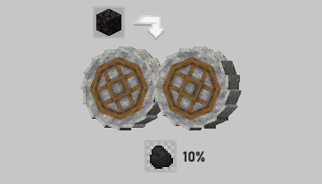
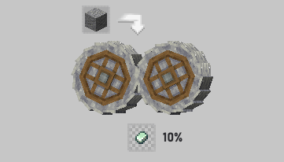
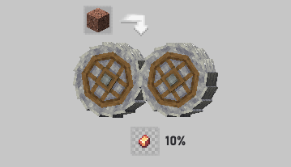
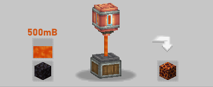
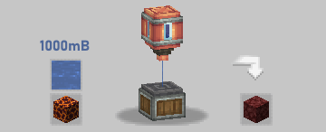
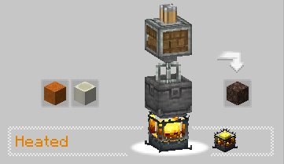
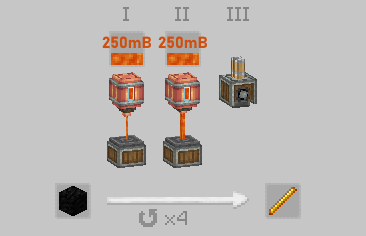
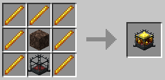
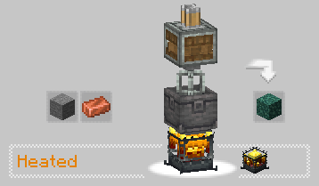
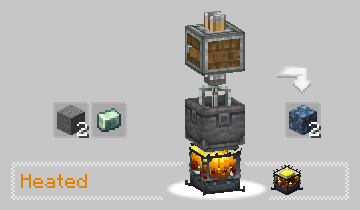
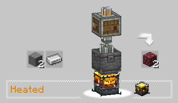
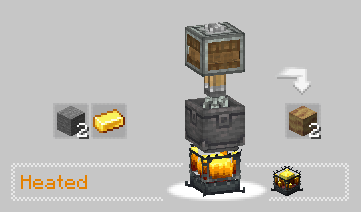
